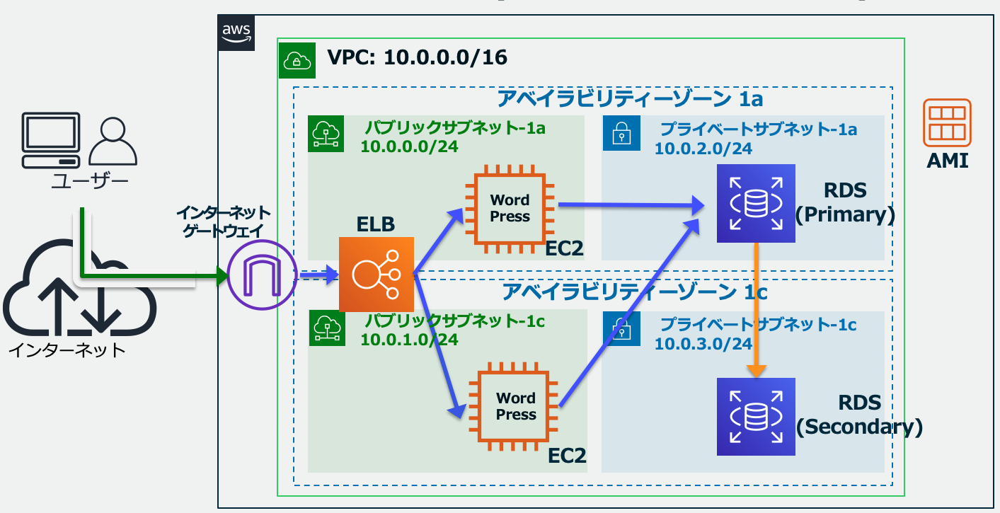

# ALBで冗長構成したWordpressサーバのサンプル

## 構成

[AWSのハンズオン](https://catalog.us-east-1.prod.workshops.aws/workshops/47782ec0-8e8c-41e8-b873-9da91e822b36/ja-JP)の通り.  

## memo

WordPress用のAMIはあらかじめ作成しておく. その際EBSのスナップショットが作成される.

## TODO

[Next Step](https://catalog.us-east-1.prod.workshops.aws/workshops/47782ec0-8e8c-41e8-b873-9da91e822b36/ja-JP/hands-on/phase11)
[Manage AWS RDS instances](https://developer.hashicorp.com/terraform/tutorials/aws/aws-rds?utm_medium=WEB_IO&in=terraform%2Faws&utm_content=DOCS&utm_source=WEBSITE&utm_offer=ARTICLE_PAGE)
